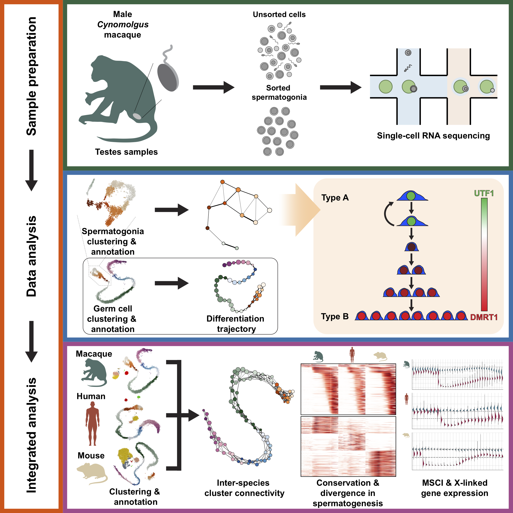

## Single-Cell RNA Sequencing of the *Cynomolgus* Macaque Testis Reveals Conserved Transcriptional Profiles during Mammalian Spermatogenesis

### Graphical Abstract

### Data availability and code
The raw fastq files and processed data for *cynomolgus* is publicly available at ArrayExpress: E-MTAB-8979 (https://www.ebi.ac.uk/arrayexpress/experiments/E-MTAB-8979/).

The code used and analysis conducted on all the datasets used in this paper is available as Jupyter notebook htmls under the [HTML](../master/HTML/) folder of thus repository.

Processed files of *Cynomolgus* macaque can be obtained from ArrayExpress and the IPython notebook can used to reproduce the analysis.
